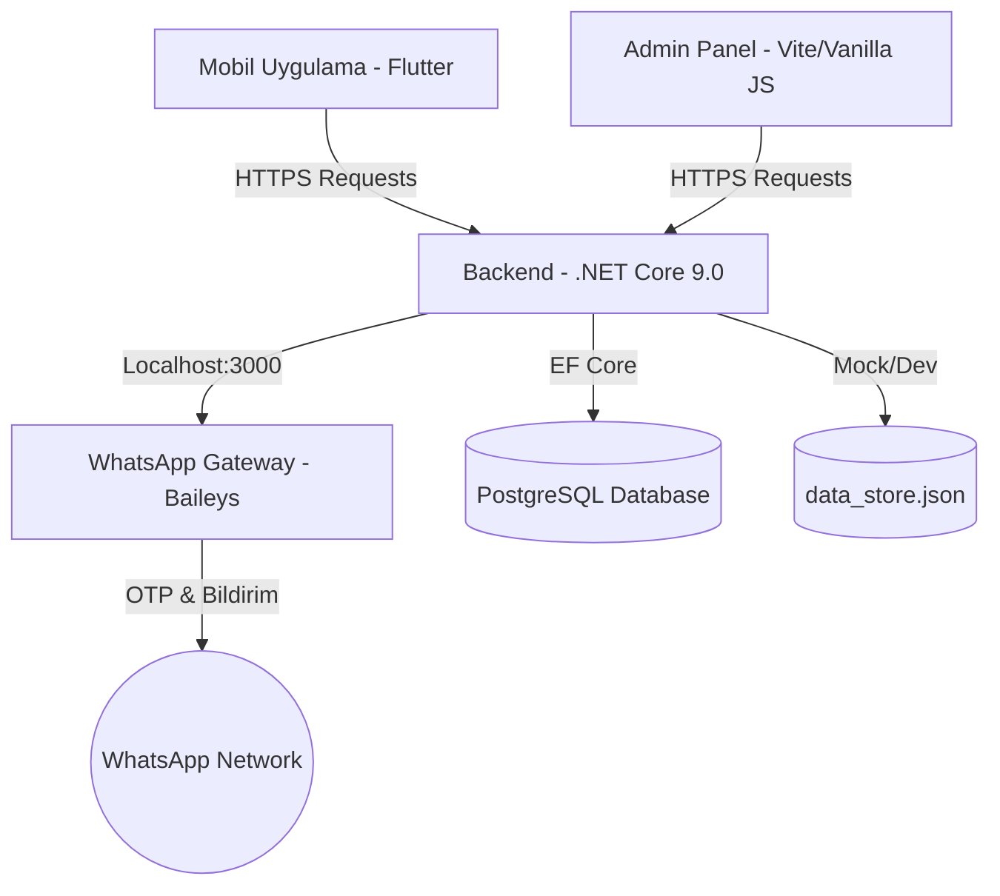

# 🤲 Askıda (Dayanışma Platformu)

Bu proje; ihtiyaç sahipleri (özellikle öğrenciler) ile hayırseverleri ve işletmeleri buluşturan, asırlık "askıda yemek/ürün" geleneğini modern teknolojiyle dijitalleştiren bir yardımlaşma platformudur. Sistem, şeffaflık ve güven ilkelerine dayalı olarak çalışır.

---

## 🏗️ Teknoloji Yığını ve Mimari (Tech Stack)

Proje 4 ana bileşenden oluşmaktadır:

### 1. Backend (C# ASP.NET Core 9.0)
- **Dizin:** `/Askida.Api`
- **Veritabanı:** PostgreSQL (Entity Framework Core kullanılarak).
  - **Veri Depolama Yapılandırması:** `appsettings.json` içerisindeki `Infrastructure:UsePostgreSql` parametresine bağlıdır. Değer `true` ise PostgreSQL kullanılır, `false` ise geçici in-memory / JSON tabanlı veri saklama sunan `FakeRepositories` devreye girer (veriler `/Askida.Api/data_store.json` dosyasında tutulur).
- **Mimari:** Dependency Injection tabanlı, Repository & Service katmanlarıyla ayrılmış modüler yapı.
- **Kimlik Doğrulama:** JWT (JSON Web Token) tabanlı güvenli oturum.
- **Entegrasyonlar:** E-posta (SMTP) ve WhatsApp (Twilio/Yerel Gateway) destekli OTP (Tek Kullanımlık Şifre) sistemleri.
- **Geriye Dönük Uyumluluk:** Yeni sistemin tekil `Aid` (İlan/Yardım) modeli üzerinden çalışmasıyla beraber, eski admin panellerinin çökmemesi için eski API uçları (`/products`, `/donations`, `/requests`) yeni modele yönlendirilerek korundu. Son yapılan güncellemeyle `/products` üzerinden ürün oluşturulurken Google Play Product ID ve Subscription Type entegrasyonu da `/ProductsController.cs` altında tamamlanmıştır.
- **Sunucu & Deployment:** Docker ve `docker-compose` kullanılarak Ubuntu VPS (`195.35.56.82`) üzerinde otomatikleştirilmiş Python scriptleriyle (`upload.py`, `vps_ssh.py`) deploy edilmektedir.

### 2. Mobil Uygulama (Flutter)
- **Dizin:** `/lib`
- **Durum Yönetimi (State Management):** Riverpod v3 (`Notifier` ve `NotifierProvider` mimarisi).
- **Yönlendirme (Routing):** `go_router` paketi.
- **Ağ İstekleri:** `dio` paketi ile API haberleşmesi (`api_client.dart`).
- **Öne Çıkan Özellikler & Koruma Mekanizmaları:**
  - **Auth & Profil:** Otomatik oturum yönetimi (SplashScreen üzerinden `authProvider` kontrolü ile), Öğrenci doğrulama süreçleri (belge upload) ve geçmiş işlemler.
  - **Feed (İlanlar Akışı):** Aktif "askıda" ilanlarının listelendiği, filtrelendiği gelişmiş akış.
  - **Bildirimler:** Firebase Cloud Messaging (FCM) altyapısı ve `flutter_local_notifications` ile sesli, titreşimli yerel anlık bildirimler.
  - **Spam ve Mükerrer İstek Koruması:** Öğrencilerin talep butonuna (`ad_detail_screen.dart`) veya Google Play üzerinden ödeme butonuna (`packages_screen.dart`) arka arkaya basarak spam yapmasını önlemek amacıyla **3 saniyelik Cooldown (bekleme kilidi)** eklenmiştir. Ayrıca uygulama içi satın alım süreçlerinde null-güvenli iyileştirmeler yapılmıştır.
  - **Sürüm:** Güncel Play Store sürüm numarası `1.0.12+15` olarak güncellenmiştir.

### 3. Yönetim Paneli (Web Admin Panel)
- **Dizin:** `/askida-admin-web`
- **Özet:** İşletmelerin, öğrencilerin ve sistemdeki askı ilanlarının/takiplerinin yapıldığı, API'nin veritabanına entegre hafif bir web arayüzü (Vite + Vanilla JS/CSS altyapısında).
- **Son Güvenlik ve Arayüz Güncellemeleri:**
  - **Oturum Yönetimi:** Admin girişlerine **2 saatlik aktif süre sınırı** getirilmiştir. Bu sürenin sonunda oturum otomatik olarak sonlandırılır.
  - **Gelişmiş Filtreleme:** Ürün listeleme ekranında, öğrencilerin oluşturduğu alt talep (portion) kayıtlarının görünmemesi için sadece ana ilanlar (`parentId` bilgisi boş olanlar) filtrelenerek listelenmektedir.
  - **Yönlendirme Güncellemesi:** Klasik hash yönlendirmesi (`#/admin`) yerine HTML5 history API (`popstate` ile `/admin`) yapısına geçilmiştir.
  - **Güvenlik:** Giriş formlarındaki geliştirme aşamasından kalan varsayılan kullanıcı adı/şifre doldurma alanları kaldırılmıştır.

### 4. WhatsApp Gateway
- **Dizin:** `/whatsapp-gateway`
- **Teknoloji:** Node.js, `@whiskeysockets/baileys` kütüphanesi.
- **Çalışma Prensibi:** Yerel makinede `3000` portundan servis vererek API üzerinden gelen mesajları WhatsApp protokolüne çevirir. İlk bağlantı kurulurken ekranda ve proje kök dizinindeki `/qr.png` dosyasında bir QR kod oluşturup taratılmasını bekler.

---

## ⚙️ Temel İş Mantığı ve Platform Kuralları (Business Logic)

Sistemdeki en kritik dinamikler aşağıda tanımlanmıştır:

1. **Rol Tabanlı Deneyim:**
   - **Öğrenci (Student):** Yardıma ihtiyacı olan taraftır. Uygulamayı kullanabilmek için belge doğrulaması gerekir. Öğrenciler ilan akışındaki ürünlerin veya yardımların **maddi fiyatını kesinlikle göremez**. Amaç, yardım alırken mahcubiyeti önlemektir. 
   - **İşletme (Business):** Askıya yemek/ürün ekleyen işletmelerdir.
   - **Destekçi (Supporter):** Askıdaki ürünleri finanse eden hayırseverlerdir.

2. **Talep (Request) Kontrolü:** 
   - Bir öğrenci herhangi bir ilana talep gönderdiğinde, bu talep onaylanana ya da reddedilene kadar **aynı ilana ikinci bir talep gönderemez**.
   - Talepler ana ilanın stoğunu bozmaz. Her talep için backend tarafında ana ilanın kopyası olarak üretilen, `ParentId` değerine sahip yeni bir `Aid` kaydı oluşturulur (`Status = "Claimed"`). Onay/Red süreçleri bu alt kayıtlar üzerinden yürütülür.

3. **Kullanıcı Deneyimi & Oturum:**
   - **Splash Screen Beklemesi:** Uygulama açıldığında profilin yüklenmesi için 2 saniye zorunlu bekleme + API yanıt beklemesi süreci vardır. İnternet yavaşsa veya hata dönerse bile oturum kapatılmaz (try-catch korumalıdır), kullanıcı doğrudan anasayfaya yönlendirilir.
   - **Hesap Ayarları:** Gereksiz karmaşıklığı önlemek adına "Şifre değiştir" ayarı profil detaylarından çıkarılmış, standart "Şifremi Unuttum" sürecine bağlanmıştır.

4. **Medya Yönetimi:** 
   - İlan resimleri `ad.imageUrl` üzerinden her zaman `http` prefix kontrolü yapılarak render edilir. Eğer `http` yoksa uygulamanın API ana base adresi başına otomatik eklenir.

---

## 🚀 Dağıtım (Deployment) ve Google Play Kuralları

- **Android Yayınlama:** Uygulama paketi (applicationId ve namespace) `com.askida.app` olarak ayarlanmıştır. Firebase `google-services.json` dosyası da birebir bu isme göre düzenlenmiştir.
- **Native Crash Önlemi:** `MainActivity.kt` dosyası Android manifest `android:name=".MainActivity"` parametresine uygun olarak `android/app/src/main/kotlin/com/askida/app/` yolunda tutulmalıdır.
- **Sürüm Güncellemeleri:** Her Play Console güncellemesinde `pubspec.yaml` dosyasındaki `version: x.y.z+buildNumber` kısmındaki **`+buildNumber` (sürüm kodu) mutlaka bir artırılmalıdır.** (Son güncel Play Store Sürüm Kodu: **15**)
- **Dağıtım Scriptleri:** Python tabanlı `upload.py` ve `upload_frontend.py` scriptleri aracılığıyla Dockerize edilmiş API ve static admin build'leri doğrudan Ubuntu VPS'e yüklenir.
